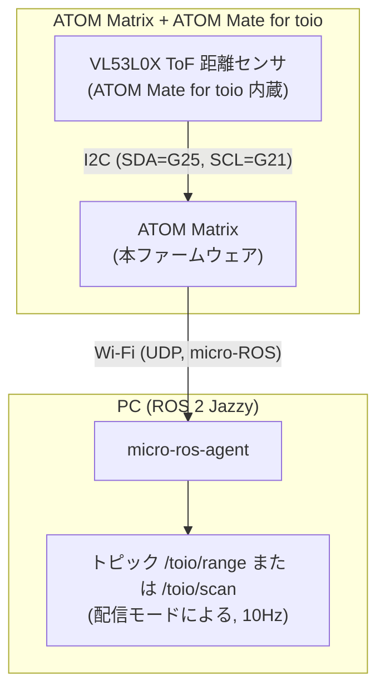

# atom_mate_toio_ros2

[](https://github.com/atinfinity/atom_mate_toio_ros2/actions/workflows/build.yml)

ATOM Matrix + [ATOM Mate for toio](https://www.switch-science.com/products/8500) の内蔵距離センサ(VL53L0X ToF)の測定値を、Wi-Fi 経由で ROS 2 Jazzy のトピックとして publish するファームウェアです。配信モードをビルド時に選択でき、`sensor_msgs/Range`(デフォルト)または `sensor_msgs/LaserScan` のどちらか一方を配信します。

※ ATOM Mate for toio の内蔵距離センサは超音波ではなく **ToF(レーザー)方式の VL53L0X** です(測定範囲 最大2m)。

## 構成



- センサ接続: ATOM Mate for toio 装着のみ(I2C: SDA=G25, SCL=G21)。追加配線不要。
- QoS: best-effort(センサストリームの標準)
- 配信モード(`config.h` の `PUBLISH_MODE` でコンパイル時に選択。どちらか一方のみ配信):
  - `PUBLISH_MODE_RANGE`(デフォルト): `sensor_msgs/Range` を `toio/range` に配信
  - `PUBLISH_MODE_SCAN`: `sensor_msgs/LaserScan`(正面方向の1ビーム)を `toio/scan` に配信。LaserScan しか受け付けないツール(nav2 の obstacle layer 等)にそのまま渡したい場合に使用
- ステータス: **ATOM Matrix 本体の 5x5 LED マトリクス**で表示(赤=Wi-Fi 接続中 / 黄=agent 待ち / 緑=publish 中)。本 README で「LED」と書いた場合はすべてこの ATOM Matrix の LED を指します(toio 本体にも LED がありますが、本ファームウェアからは制御していません)。

## 必要なもの

- ATOM Matrix + ATOM Mate for toio
- [PlatformIO](https://platformio.org/)(VSCode 拡張 or CLI)
- ROS 2 Jazzy 環境の PC(micro-ros-agent を実行。Docker 利用可)

### ビルドに必要な追加ツール(macOS)

micro_ros_platformio のライブラリ生成(libmicroros)に以下が必要です。無いとビルドが失敗します。

```bash
# cmake(PlatformIO の Python 環境内に入れると確実)
~/.platformio/penv/bin/pip install cmake

# GNU binutils(micro_ros_platformio が /opt/homebrew/opt/binutils/ を参照する)
brew install binutils
```

※ 本リポジトリ作成時(2026-08-12)に上記2点のインストールで初回ビルド成功を確認済み。

## セットアップ

### 1. 設定ファイルの作成

```bash
cp include/config.h.example include/config.h
```

`include/config.h` を編集して Wi-Fi SSID/パスワードと、micro-ros-agent を動かす PC の IP アドレスを設定してください。

### 2. ビルド & 書き込み

```bash
pio run -t upload
pio device monitor   # ログ確認(115200bps)
```

初回ビルドは libmicroros の生成に数分かかります(Python3 が必要)。

### 3. micro-ros-agent の起動(PC 側)

Docker を使う場合:

```bash
docker run -it --rm --net=host microros/micro-ros-agent:jazzy udp4 --port 8888
```

ROS 2 環境にソースビルド済みの場合:

```bash
ros2 run micro_ros_agent micro_ros_agent udp4 --port 8888
```

agent に接続されると ATOM Matrix の LED が緑になります。

## 単体テスト

ハードウェア非依存のロジック(`lib/toio_range_logic/`)は、native 環境(ホスト上)で Unity による単体テストを実行できます。実機は不要です。対象は距離値の変換・out-of-range 判定・タイムスタンプ変換・scan モードの LaserScan 構成パラメータです。テストスイートは `test/test_range_logic/`(range 系)と `test/test_scan_logic/`(scan 系)の2つです。

```bash
pio test -e native
```

CI(GitHub Actions)でも push / Pull Request ごとに実行されます。

## 動作確認

range モード(デフォルト):

```bash
ros2 topic list                 # /toio/range が表示される
ros2 topic echo /toio/range     # 手をかざすと range が変化する
ros2 topic hz /toio/range       # 約 10Hz
```

scan モード(`PUBLISH_MODE_SCAN` でビルドした場合):

```bash
ros2 topic echo /toio/scan      # ranges[0] に距離が入る
ros2 topic hz /toio/scan        # 約 10Hz
```

## メッセージ仕様

### range モード(`sensor_msgs/Range`、トピック `toio/range`)

| フィールド | 値 |
|---|---|
| `header.frame_id` | `toio_range_link` |
| `header.stamp` | agent と時刻同期した epoch 時刻 |
| `radiation_type` | `INFRARED (1)` |
| `field_of_view` | 0.44 rad(約25°) |
| `min_range` / `max_range` | 0.03 m / 2.0 m |
| `range` | 測定距離 [m]。検出なし(out of range)時は `+Inf` |

### scan モード(`sensor_msgs/LaserScan`、トピック `toio/scan`)

単一点センサのため、正面方向の1ビームだけを持つ LaserScan として配信します。

| フィールド | 値 |
|---|---|
| `header.frame_id` / `header.stamp` | range モードと同じ |
| `angle_min` / `angle_max` / `angle_increment` | すべて 0(正面1ビーム) |
| `time_increment` | 0 |
| `scan_time` | 0.1 s(publish 周期) |
| `range_min` / `range_max` | 0.03 m / 2.0 m |
| `ranges` | 要素数1。測定距離 [m]、検出なし時は `+Inf` |
| `intensities` | 空 |

## トラブルシューティング

- **ATOM Matrix の LED が赤のまま**: Wi-Fi に接続できていません。SSID/パスワードを確認してください(2.4GHz 帯のみ対応)。
- **ATOM Matrix の LED が黄のまま**: agent に接続できていません。`AGENT_IP` が PC の IP と一致しているか、agent が起動しているか、ファイアウォールで UDP 8888 が塞がれていないか確認してください。
- **`VL53L0X not found` がシリアルに出る**: ATOM Mate for toio の装着(ピン接触)を確認してください。
