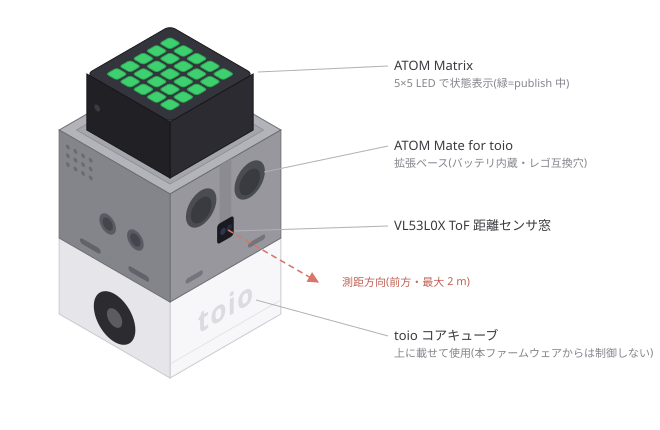
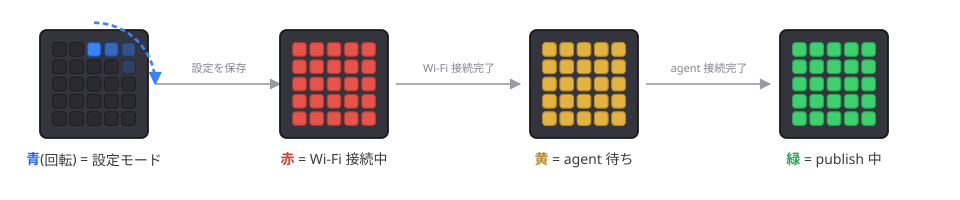

# atom_mate_toio_ros2

[](https://github.com/atinfinity/atom_mate_toio_ros2/actions/workflows/build.yml)

ATOM Matrix + [ATOM Mate for toio](https://www.switch-science.com/products/8500) の内蔵距離センサ(VL53L0X ToF)の測定値を、Wi-Fi 経由で ROS 2 Jazzy のトピックとして publish するファームウェアです。



※ 公開されている製品写真・寸法をもとに作成したイメージ図です。細部は実物と異なります。

## できること

- VL53L0X ToF 距離センサ(測定範囲 最大2m)の測定値を Wi-Fi(micro-ROS)経由で約 10Hz で配信
- 配信モードをビルド時に選択: `sensor_msgs/Range`(デフォルト)または `sensor_msgs/LaserScan`
- 接続状態を ATOM Matrix の 5x5 LED で表示(赤=Wi-Fi 接続中 / 黄=agent 待ち / 緑=publish 中)
- 追加配線は不要(ATOM Mate for toio を装着するだけ)



## クイックスタート

```bash
cp include/config.h.example include/config.h   # Wi-Fi と agent の IP を設定
pio run -t upload                              # ビルド & 書き込み

# PC 側で micro-ros-agent を起動(Docker の場合)
docker run -it --rm --net=host microros/micro-ros-agent:jazzy udp4 --port 8888

ros2 topic echo /toio/range                    # 手をかざすと range が変化する
```

詳しい手順(macOS で必要な追加ツールなど)は[セットアップガイド](docs/setup.md)を参照してください。

## ドキュメント

| ドキュメント | 内容 |
|---|---|
| [セットアップガイド](docs/setup.md) | 必要なもの、ビルド・書き込み、micro-ros-agent の起動、動作確認 |
| [構成とメッセージ仕様](docs/architecture.md) | システム構成、配信モード、トピックとメッセージの詳細 |
| [単体テスト](docs/testing.md) | native 環境での単体テストの実行方法 |
| [トラブルシューティング](docs/troubleshooting.md) | LED が赤/黄のままなど、よくある問題と対処 |
