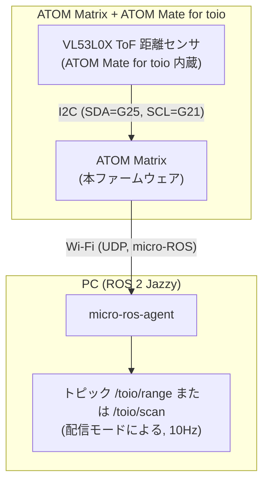

# 構成とメッセージ仕様

## システム構成

- センサ接続: ATOM Mate for toio 装着のみ(I2C: SDA=G25, SCL=G21)。追加配線不要。
- QoS: best-effort(センサストリームの標準)
- 配信モード(`config.h` の `PUBLISH_MODE` でコンパイル時に選択。どちらか一方のみ配信):
  - `PUBLISH_MODE_RANGE`(デフォルト): `sensor_msgs/Range` を `toio/range` に配信
  - `PUBLISH_MODE_SCAN`: `sensor_msgs/LaserScan`(正面方向の1ビーム)を `toio/scan` に配信。LaserScan しか受け付けないツール(nav2 の obstacle layer 等)にそのまま渡したい場合に使用
- ステータス: **ATOM Matrix 本体の 5x5 LED マトリクス**で表示(赤=Wi-Fi 接続中 / 黄=agent 待ち / 緑=publish 中)。本ドキュメントで「LED」と書いた場合はすべてこの ATOM Matrix の LED を指します(toio 本体にも LED がありますが、本ファームウェアからは制御していません)。

※ ATOM Mate for toio の内蔵距離センサは超音波ではなく **ToF(レーザー)方式の VL53L0X** です(測定範囲 最大2m)。

## メッセージ仕様

### range モード(`sensor_msgs/Range`、トピック `toio/range`)

| フィールド | 値 |
|---|---|
| `header.frame_id` | `toio_range_link` |
| `header.stamp` | agent と時刻同期した epoch 時刻 |
| `radiation_type` | `INFRARED (1)` |
| `field_of_view` | 0.44 rad(約25°) |
| `min_range` / `max_range` | 0.03 m / 2.0 m |
| `range` | 測定距離 [m]。検出なし(out of range)時は `+Inf` |

### scan モード(`sensor_msgs/LaserScan`、トピック `toio/scan`)

単一点センサのため、正面方向の1ビームだけを持つ LaserScan として配信します。

| フィールド | 値 |
|---|---|
| `header.frame_id` / `header.stamp` | range モードと同じ |
| `angle_min` / `angle_max` / `angle_increment` | すべて 0(正面1ビーム) |
| `time_increment` | 0 |
| `scan_time` | 0.1 s(publish 周期) |
| `range_min` / `range_max` | 0.03 m / 2.0 m |
| `ranges` | 要素数1。測定距離 [m]、検出なし時は `+Inf` |
| `intensities` | 空 |
